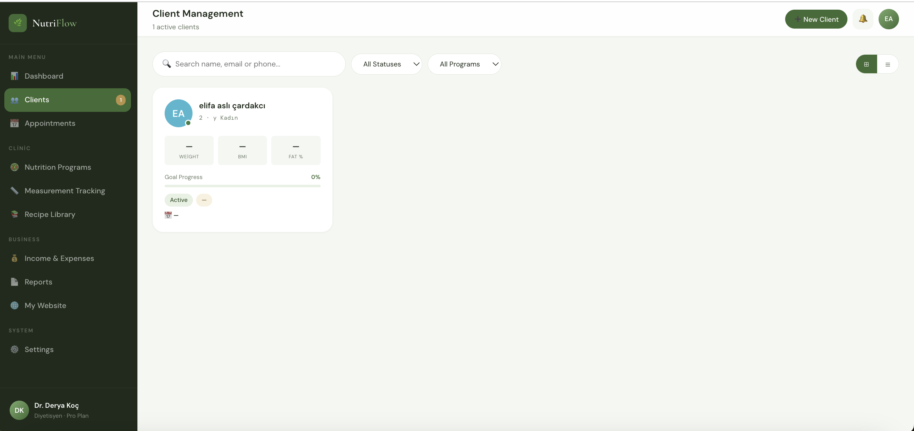
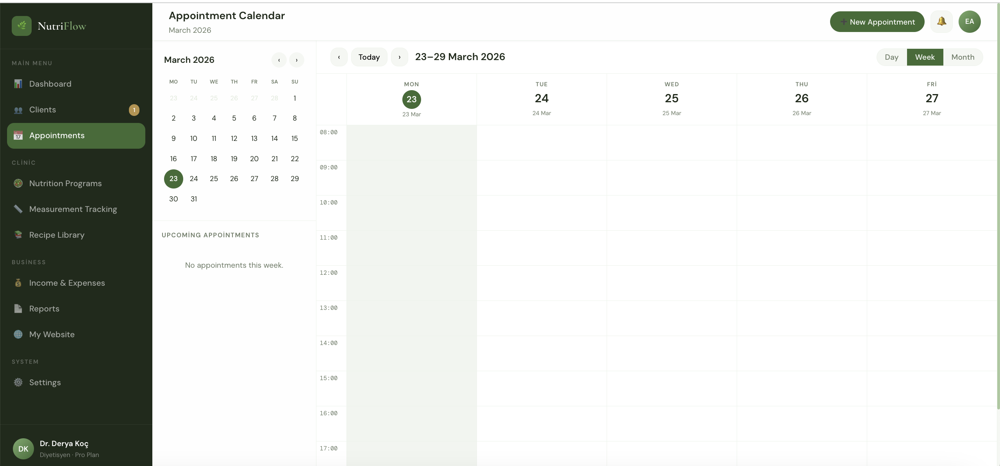
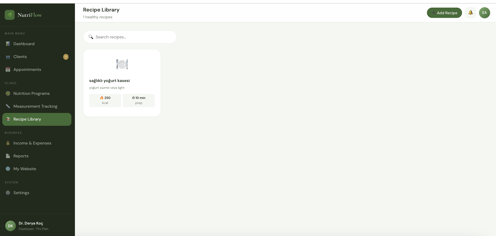

# NutriFlow Frontend

Modern React-based frontend application for the NutriFlow dietitian management panel.

## Overview

A responsive, single-page application built with React 18 and Vite that provides a complete interface for dietitians to manage their practice. Features a clean, modern UI with real-time data visualization, interactive calendars, and comprehensive client management tools.

## Tech Stack

| Technology | Purpose |
|-----------|---------|
| **React 18** | UI framework with hooks |
| **Vite** | Build tool and dev server |
| **React Router** | Client-side routing |
| **Axios** | HTTP client with interceptors |
| **Chart.js** | Data visualization |
| **CSS Variables** | Theming and styling |

## Project Structure

```
panel-fe/
├── src/
│   ├── api/                    # API service layer
│   │   ├── axiosInstance.js    # Configured Axios instance
│   │   ├── authService.js      # Authentication endpoints
│   │   ├── clientService.js    # Client management
│   │   ├── appointmentService.js
│   │   ├── dietPlanService.js
│   │   ├── recipeService.js
│   │   └── ...                 # Other service modules
│   ├── components/             # Reusable components
│   │   ├── AppLayout.jsx       # Main layout wrapper
│   │   ├── Sidebar.jsx         # Navigation sidebar
│   │   ├── Topbar.jsx          # Page header component
│   │   └── ProtectedRoute.jsx  # Auth guard
│   ├── contexts/               # React contexts
│   │   └── AuthContext.jsx     # Authentication state
│   ├── hooks/                  # Custom hooks
│   │   ├── useApi.js           # API call hook with loading states
│   │   └── useToast.js         # Toast notification system
│   ├── pages/                  # Page components
│   │   ├── Login.jsx
│   │   ├── Landing.jsx
│   │   ├── Dashboard.jsx
│   │   ├── Danisanlar.jsx      # Clients
│   │   ├── Randevular.jsx      # Appointments
│   │   ├── IsletmePages.jsx    # Business pages
│   │   └── KlinikPages.jsx     # Clinic pages
│   ├── styles/                 # Global styles
│   │   └── global.css          # CSS variables and base styles
│   ├── utils/                  # Utility functions
│   │   ├── dataTransformers.js # Data formatting
│   │   └── errorHandlers.js    # Error processing
│   ├── App.jsx                 # Root component with routes
│   └── main.jsx                # Entry point
├── public/                     # Static assets
├── index.html
├── vite.config.js
└── package.json
```

## Key Features

### Architecture Patterns

- **Service Layer**: Centralized API calls in `/api` folder with consistent error handling
- **Custom Hooks**: `useApi` for data fetching with loading/error states, `useToast` for notifications
- **Context API**: Global authentication state management
- **Protected Routes**: Route guards for authenticated pages
- **Axios Interceptors**: Automatic token injection and error handling

### UI Components

- Responsive layout with sidebar navigation
- Interactive data tables with sorting and filtering
- Modal dialogs for forms and details
- Toast notifications for user feedback
- Chart.js integration for analytics
- Calendar view for appointments
- Custom CSS with design system variables

### State Management

- React Context for authentication
- Local state with `useState` for component-level data
- `useEffect` for side effects and data fetching
- Custom `useApi` hook for server state

## Quick Start

### Prerequisites

- Node.js 18+
- Backend API running on `http://localhost:8000`

### Installation

```bash
npm install
```

### Development

```bash
npm run dev
```

The app will be available at `http://localhost:5173`.

### Build

```bash
npm run build
```

Production files will be in the `dist/` folder.

### Preview Production Build

```bash
npm run preview
```

## Environment Configuration

The frontend connects to the backend API via the base URL configured in `src/api/axiosInstance.js`:

```javascript
const instance = axios.create({ 
  baseURL: 'http://localhost:8000/api' 
});
```

For production, update this to your production API URL.

## Features by Page

### Dashboard (`/dashboard`)
- Real-time statistics (clients, appointments, revenue)
- Revenue trend chart
- Upcoming appointments list
- Quick action buttons

### Clients (`/clients`)
- Client list with search and filters
- Client detail modal with tabs (Info, Goals, Notes, Measurements)
- Add/edit client forms
- Client status management

### Appointments (`/appointments`)
- Calendar view (day/week/month)
- Appointment creation with conflict detection
- Status updates (scheduled, completed, cancelled, no-show)
- Today's appointments sidebar

### Nutrition Programs (`/programs`)
- Diet plan creation and management
- Meal planning with food composition
- Recipe assignment to plans
- Program status tracking

### Measurements (`/measurements`)
- Body measurement tracking
- Weight trend charts
- BMI calculation
- Measurement history table

### Recipes (`/recipes`)
- Recipe library with search
- Nutritional information display
- Recipe creation with ingredients
- Send to client functionality

### Income & Expenses (`/income-expenses`)
- Payment tracking
- Monthly revenue trends
- Payment method breakdown
- Financial summary

### Reports (`/reports`)
- Performance analytics
- Client success metrics
- Revenue reports
- Downloadable reports

### My Website (`/my-website`)
- Personal clinic website management
- Theme customization
- Content editing
- Booking settings

### Settings (`/settings`)
- Profile management
- Password change
- Notification preferences
- Plan & billing information

## Screenshots

### Dashboard

*Real-time statistics, revenue trends, and upcoming appointments*

### Clients

*Client management with detailed profiles and measurement tracking*

### Appointments

*Calendar-based appointment scheduling with conflict detection*

### Recipes

*Recipe library with nutritional information and search*

## Development Notes

- All routes are protected except `/login` and `/`
- JWT tokens are stored in localStorage
- Axios interceptors handle token refresh and errors
- Toast notifications provide user feedback
- CSS variables enable easy theming
- Components follow functional component pattern with hooks

## API Integration

The frontend communicates with the backend via RESTful API calls. All services in `/api` return promises and handle errors consistently. The `useApi` hook provides a convenient way to fetch data with loading and error states:

```javascript
const { data, isLoading, error, refetch } = useApi(getClients, []);
```

## License

This project is developed for educational purposes.
